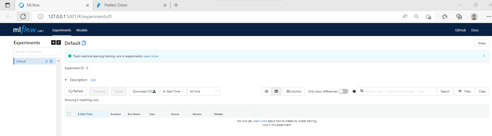

# Objective #

We are taking the same Taxi Duration Prediction use case that we worked on in past. This time for the homework purpose we are using linear regression model and entire training pipeline is put into [homework.py](./homework.py) file. In this script we are neither tracking the experimental runs nor orchestrating any workflows.

We need to accomplish the following requirements so as to get familiar with Prefect flow engine.

* The training flow will be run every month.
* The flow will take in a parameter called date which will be a datetime.
  * a. date should default to None.
  * b. If date is None, set date as the current day. Use the data from 2 months back as the training data and the data from the previous month as validation data.
  * c. If date is passed, get 2 months before the date as the training data, and the previous month as validation data.
  * d. As a concrete example, if the date passed is "2021-03-15", the training data should be "fhv_tripdata_2021-01.parquet" and the validation file will be "fhv_trip_data_2021-02.parquet".
* Save the model as "model-{date}.bin" where date is in YYYY-MM-DD. Note that date here is the value of the flow parameter. In practice, this setup makes it very easy to get the latest model to run predictions because you just need to get the most recent one.
* In this example we use a DictVectorizer. That is needed to run future data through our model. Save that as "dv-{date}.b". Similar to above, if the date is 2021-03-15, the files output should be model-2021-03-15.bin and dv-2021-03-15.b.

# Set up #

## Setting up mlflow ##

I am using the same AWS VM that was used in the first module. Here is the [link](https://github.com/BPrasad123/MLOps_Zoomcamp/tree/main/Week1) to take a look at the steps again. All I had to for now to start the mlflow UI was just to execute the following in the terminal connected to the VM host.

```mlflow ui --backend-store-uri sqlite:///mlflow.db```



## Setting up Prefect ##
For Prefect also I used the same VM.

Just like mlflow, we got to pip install perfect as well.  

```pip install prefect==2.0b5```

Prefect 2 comes with a component called Orion that is a server instance (UI) to monitor the workflows. Just like for mlflow UI, we can run the following commands to start the orion server UI.

Change the inbound traffic for the VM in the attached security group as follows.  

Note: Here, I have allowed the traffic from any sources that runs with higher risk. We can restrict the access from specific IP ranges only, if required.


As per the [instructions](https://discourse.prefect.io/t/hosting-a-remote-orion-instance-on-a-cloud-vm/967) given, run the following commands as to use Prefect Orion hosted on a VM.

```prefect config set PREFECT_ORION_UI_API_URL="http://<public_ip>/api"```

Verify if configuration got set correctly,  
```prefect config view PREFECT_ORION_UI_API_URL```

If the IP is different, reset using following command.  
```prefect config unset PREFECT_ORION_UI_API_URL```

To bind ip run the following  
```prefect orion start --host 0.0.0.0```

Go to the browser to open Prefect Orion UI   
http://<public_ip>:4201


## Changes in pipeline ##

Please refer the solution code with comments.

[Homework solution](/homework_solution.py)  
Note: Only docstrings and comments added to the already shared solution script.

Run the solution script in the terminal of the VM and we will see logs similar to as following.


Then when we will see the Task and Flow logs in the Orion UI as follows.


Since we have enabled tracking the experiment in MLflow, we can check the details on the mlflow UI as well.


