## Disclaimer ##
I followed the same steps as instructed in the course given by DataTalksClub and used the same code as shared in the tutorial. Only where required, I have made necessary changes for it to work for me.

DataTalksClub tutorial:  
https://github.com/DataTalksClub/mlops-zoomcamp/tree/main/04-deployment/streaming


## Deployment as streaming service ##

In this part we deploying the model as serverless function that caters to streaming events. For that we are using AWS Kinesis as streaming service and AWS Lambda for serverless deployment.

**Architectural diagram**  


## Step 1: Create a role in AWS IAM ##
Go to AWS console and create an execution role.

* Open the roles page in the IAM console.
* Choose Create role.
* Create a role with following steps.
    * Select Trusted entity type – Amazon service.
    * Select Lambda as Use Case.
    * On Next page search for AWSLambdaKinesisExecutionRole.
    * On Next page create the role with name lambda-kinesis-role.

AWSLambdaKinesisExecutionRole deafult permissions:
``` JSON
{
    "Version": "2012-10-17",
    "Statement": [
        {
            "Effect": "Allow",
            "Action": [
                "kinesis:DescribeStream",
                "kinesis:DescribeStreamSummary",
                "kinesis:GetRecords",
                "kinesis:GetShardIterator",
                "kinesis:ListShards",
                "kinesis:ListStreams",
                "kinesis:SubscribeToShard",
                "logs:CreateLogGroup",
                "logs:CreateLogStream",
                "logs:PutLogEvents"
            ],
            "Resource": "*"
        }
    ]
}
```

The AWSLambdaKinesisExecutionRole policy has the permissions that the function needs to read items from Kinesis and write logs to AWS CloudWatch.

## Step 2: Create a Lambda function ##
[1]  
Create a new lambda function by authoring from scratch.


[2]  
**Test to understand how Lambda function works**

This is how the default Lambda function script looks like.


If we are making any changes to the script then we have to `deploy` it so as to save the changes.


[3]  
Lambda function takes `event` as an input in JSON format. We need to create an `event` to test the Lambda function. For that click on 'Configure test event' in the dropdown just next to Test botton.


It is pretty intuitive how to create a new event or to modify an existing event.


[4]  
Now click on `Test` on the lambda function and we should see the test result. In case there are multiple events, we can always select from the dropdown.

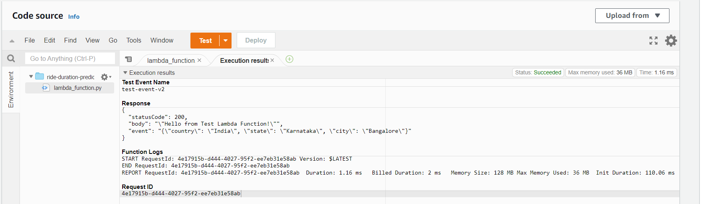

Now that we understand how lambda function works, what if we want to feed it with events from a stream automatically? For that we can create a Kinesis stream and add that as a trigger for Lambda to process its events automatically.

## Step 3: Create Kinesis data stream ##
Select these options while creating a new kinesis data stream.

[1]  
Create a kinesis data stream.


[2]  
Go to the lambda function and click on add trigger.


Select the newly created kinesis stream and leave the rest with default values.


It should look like this now.

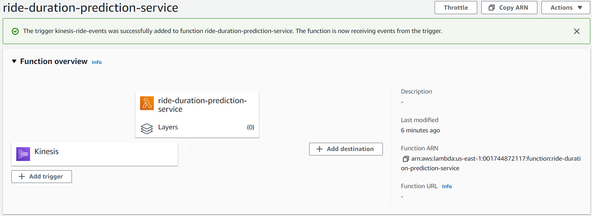


# Step 4 ##
Test if Lambda is able to process an event from Kinesis. For that create a record in Kinesis stream.

[1]  
This is how lambda function script looks like at present.

``` python
import json

def lambda_handler(event, context):
    print(json.dumps(event))
    return {
        'statusCode': 200,
        'body': json.dumps('Hello from Test Lambda Function!'),
        'event': json.dumps(event)
    }
```

[2]  
We will use AWS cli to put a record into Kinesis. For that we will have to connect to our EC2 instance and also make sure we add kinesis put record access (or kinesis full access, though not recommended) to the policy attached EC2.

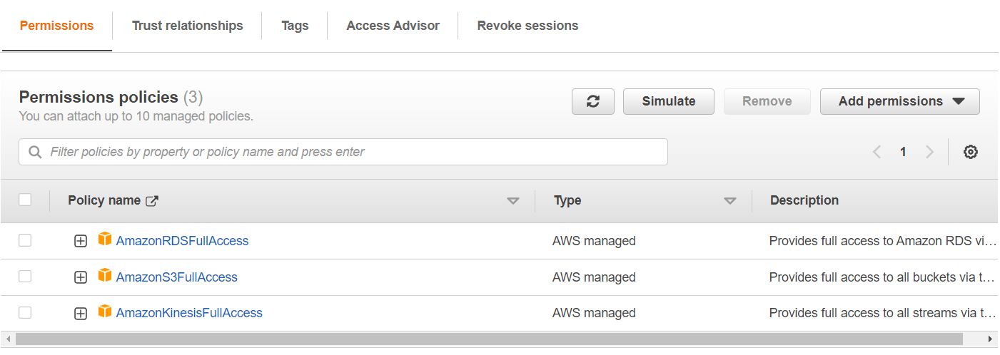


[3]  
Run the following to send a record to kinesis.

``` bash
KINESIS_STREAM_INPUT=kinesis-ride-events
aws kinesis put-record \
    --stream-name ${KINESIS_STREAM_INPUT} \
    --partition-key 1 \
    --data "Hello, this is a test."
```

[4]  
Go to Lambda > Monitor > View logs in CloudWatch to view the logs.

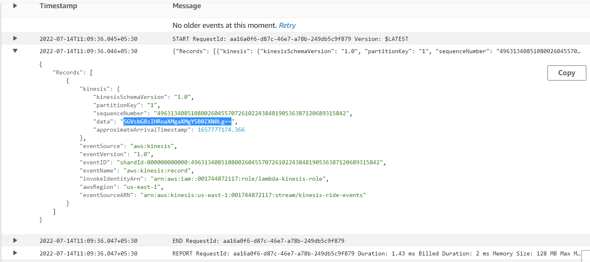

If we notice the data in the event record is not in the same format as sent initially. By default kinesis sends the base64 encoded data in the event. To print the data in readable format we will have to decode the data recieved and print the same in lambda python function.

[5]

Updated lambda function:

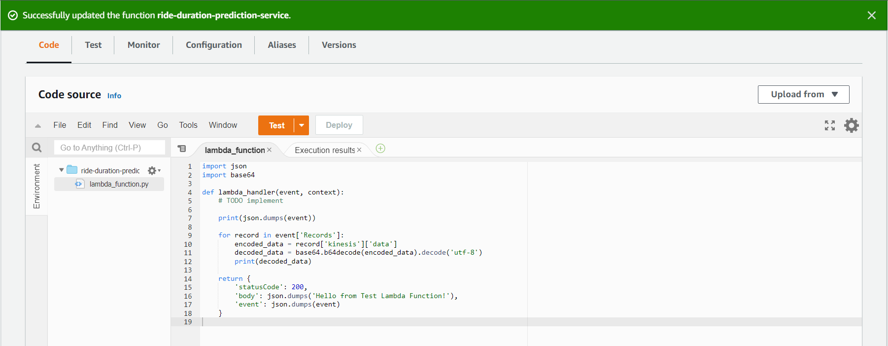


[6]  
Now put the record again into kinesis and check the lambda log in cloudwatch. It should look like this.

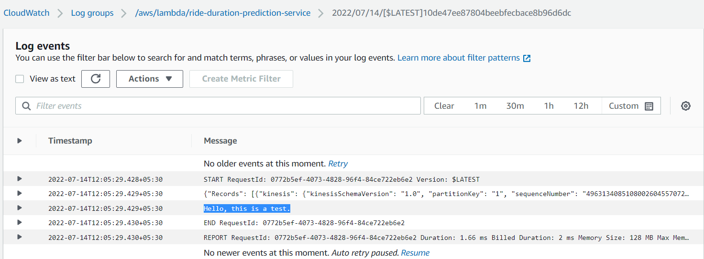

Now that we know how Lambda and Kinesis work, it is time to use the trained model in Lambda to generate prediction for the input record recieved from Kinesis.

## Step 5 ##  

We will use mlflow to load our trained model.

Reusing our prediction scripts from previous modules, we now modify the lambda function to read event from kinesis, load mlflow model, generate prediction and push the prediction result to another kinesis stream.

Here is the code for the same.

``` python
import os
import json
import boto3
import base64

import mlflow

kinesis_client = boto3.client('kinesis')

PREDICTIONS_STREAM_NAME = os.getenv('PREDICTIONS_STREAM_NAME', 'ride-predictions')
RUN_ID = os.getenv('RUN_ID', 'fd38a9df86b149e69632f44646684e49')

# replace with your s3 bucket link
logged_model = f's3://bhagabat-mlflow-rf-greentaxi/1/{RUN_ID}/artifacts/model'
model = mlflow.pyfunc.load_model(logged_model)

TEST_RUN = os.getenv('TEST_RUN', 'False') == 'True'

def prepare_features(ride):
    features = {}
    features['PU_DO'] = '%s_%s' % (ride['PULocationID'], ride['DOLocationID'])
    features['trip_distance'] = ride['trip_distance']
    return features

def predict(features):
    pred = model.predict(features)
    return float(pred[0])

def lambda_handler(event, context):
    predictions_events = []
    
    for record in event['Records']:
        encoded_data = record['kinesis']['data']
        decoded_data = base64.b64decode(encoded_data).decode('utf-8')
        ride_event = json.loads(decoded_data)

        ride = ride_event['ride']
        ride_id = ride_event['ride_id']
    
        features = prepare_features(ride)
        prediction = predict(features)
    
        prediction_event = {
            'model': 'ride_duration_prediction_model',
            'version': '123',
            'prediction': {
                'ride_duration': prediction,
                'ride_id': ride_id
            }
        }
        print(json.dumps(prediction_event))

        if not TEST_RUN:
            kinesis_client.put_record(
                StreamName=PREDICTIONS_STREAM_NAME,
                Data=json.dumps(prediction_event),
                PartitionKey=str(ride_id)
            )
        
        predictions_events.append(prediction_event)


    return {
        'predictions': predictions_events
    }

```
Prerequisites:  
* Create a new kinesis stream named `ride-preditions`
* Create a Kinesis policy with PutRecord and PutRecords, and attach that to the role of lambda
  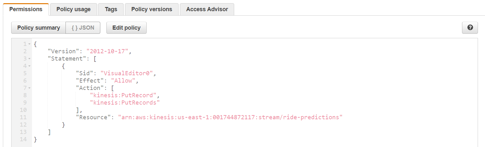
* Add the environment variables. Lambda > Configuration > Environment Variables
  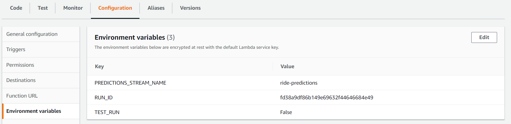

Note: Place RUN_ID with your run id.

For testing, instead of put a record to kinesis stream in AWS cli, we can configure a test event with same data in the console itself.

Configure test event with:  
``` JSON
{
    "Records": [
        {
            "kinesis": {
                "kinesisSchemaVersion": "1.0",
                "partitionKey": "1",
                "sequenceNumber": "49630081666084879290581185630324770398608704880802529282",
                "data": "ewogICAgICAgICJyaWRlIjogewogICAgICAgICAgICAiUFVMb2NhdGlvbklEIjogMTMwLAogICAgICAgICAgICAiRE9Mb2NhdGlvbklEIjogMjA1LAogICAgICAgICAgICAidHJpcF9kaXN0YW5jZSI6IDMuNjYKICAgICAgICB9LCAKICAgICAgICAicmlkZV9pZCI6IDI1NgogICAgfQ==",
                "approximateArrivalTimestamp": 1654161514.132
            },
            "eventSource": "aws:kinesis",
            "eventVersion": "1.0",
            "eventID": "shardId-000000000000:49630081666084879290581185630324770398608704880802529282",
            "eventName": "aws:kinesis:record",
            "invokeIdentityArn": "arn:aws:iam::387546586013:role/lambda-kinesis-role",
            "awsRegion": "eu-west-1",
            "eventSourceARN": "arn:aws:kinesis:eu-west-1:387546586013:stream/ride_events"
        }
    ]
}
```
Now run the test.  

**ERROR!!**

``` JSON
Response
{
  "errorMessage": "Unable to import module 'lambda_function': No module named 'mlflow'",
  "errorType": "Runtime.ImportModuleError",
  "requestId": "4f6e848e-2cd5-4cb6-88a5-183e4c970d22",
  "stackTrace": []
}
```

It is because AWS lambda function comes with some standard libraries during its runtime. However, for external libraries like `mlflow` we can either use lambda layer or deployment package.

## Step 6 ##

In our case, we will put all the code and dependencies in a docker container and create a new lambda function from the itself so that lambda runtime installs those dependencies.

However, before that we need to test if lambda function is able to put the prediction record into the newly created kinesis stream. For that we will continue with the above python script but remove mlflow part and hardcode the prediction result.

Here is the modified python script just for testing.

``` python
import os
import json
import boto3
import base64

# import mlflow

kinesis_client = boto3.client('kinesis')

PREDICTIONS_STREAM_NAME = os.getenv('PREDICTIONS_STREAM_NAME', 'ride_predictions')
RUN_ID = os.getenv('RUN_ID', 'fd38a9df86b149e69632f44646684e49')

# logged_model = f's3://bhagabat-mlflow-rf-greentaxi/1/{RUN_ID}/artifacts/model'
# model = mlflow.pyfunc.load_model(logged_model)

TEST_RUN = os.getenv('TEST_RUN', 'False') == 'True'

def prepare_features(ride):
    features = {}
    features['PU_DO'] = '%s_%s' % (ride['PULocationID'], ride['DOLocationID'])
    features['trip_distance'] = ride['trip_distance']
    return features

def predict(features):
    # pred = model.predict(features)
    pred = 10.0
    # return float(pred[0])
    return pred

def lambda_handler(event, context):
    # print(json.dumps(event))
    
    predictions_events = []
    
    for record in event['Records']:
        encoded_data = record['kinesis']['data']
        decoded_data = base64.b64decode(encoded_data).decode('utf-8')
        ride_event = json.loads(decoded_data)

        # print(ride_event)
        ride = ride_event['ride']
        ride_id = ride_event['ride_id']
    
        features = prepare_features(ride)
        prediction = predict(features)
    
        prediction_event = {
            'model': 'ride_duration_prediction_model',
            'version': '123',
            'prediction': {
                'ride_duration': prediction,
                'ride_id': ride_id
            }
        }
        print(json.dumps(prediction_event))

        if not TEST_RUN:
            kinesis_client.put_record(
                StreamName=PREDICTIONS_STREAM_NAME,
                Data=json.dumps(prediction_event),
                PartitionKey=str(ride_id)
            )
        
        predictions_events.append(prediction_event)


    return {
        'predictions': predictions_events
    }
```

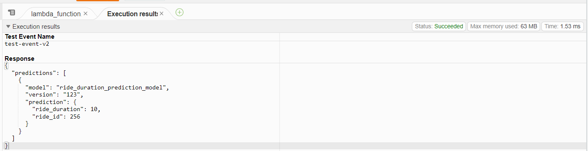

It was successful as we can see from the response message in Lambda execution result. Now, let us see if lambda was able to write that record to  `ride-predictions` kinesis stream.

Run the following in command prompt to read the record from kinesis.

``` bash
KINESIS_STREAM_OUTPUT='ride-predictions'
SHARD='shardId-000000000000'
```
``` bash
SHARD_ITERATOR=$(aws kinesis \
    get-shard-iterator \
        --shard-id ${SHARD} \
        --shard-iterator-type TRIM_HORIZON \
        --stream-name ${KINESIS_STREAM_OUTPUT} \
        --query 'ShardIterator' \
)
```
``` bash
RESULT=$(aws kinesis get-records --shard-iterator $SHARD_ITERATOR)
```
``` bash
echo ${RESULT} | jq -r '.Records[0].Data' | base64 --decode
```

You should see the output like this.

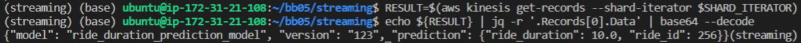

Great. Now, we need to dockerise the pipeline script and create a new lambda function from the docker container itself.

## Step 7 ## 

[1]  
Create a new virtual environment.

``` bash
pipenv shell --python=3.9
pipenv install boto3 mlflow scikit-learn
```

[2]  
Use the lambda function content from previous try and use mlflow in that to load the trained model.
Here is the updated python script [lambda_function.py](/Week4/streaming/lambda_function.py)

[3]  
Create a test script to send an event content to the above script and print the result.
Here is the test script [test.py](/Week4/streaming/test.py)

[4]  
Add the following environement variables.

``` bash
export PREDICTIONS_STREAM_NAME="ride-predictions"
export RUN_ID="fd38a9df86b149e69632f44646684e49"
export TEST_RUN="False"
```
Note: Replace with your run id.

[4]  
Now, run test.py and we should see the result similar to below in the terminal.
``` bash
python test.py
```
Result:
```
{'predictions': [{'model': 'ride_duration_prediction_model', 'version': '123', 'prediction': {'ride_duration': 18.168945726405326, 'ride_id': 256}}]}
```

[5]  
Now that it is working as expected, let us dockerise the file to use in lambda function.
Here is the [docker file](/Week4/streaming/Dockerfile).

Run the following command to build docker.

``` bash
docker build -t stream-model-duration:v1 .
```

[6]  
Download access and secret keys from AWS IAM user section and add the following environment variables.

``` bash
export AWS_ACCESS_KEY_ID='XXXXXXXXXXXX'
export AWS_SECRET_ACCESS_KEY='XXXXXXXXXXXXXXXXXXXXXXXXXXXXXXX'
export AWS_DEFAULT_REGION='XXXXXXXXX'
```

[7]  
Run docker...

``` bash
docker run -it --rm \
    -p 8080:8080 \
    -e PREDICTIONS_STREAM_NAME="ride-predictions" \
    -e RUN_ID="fd38a9df86b149e69632f44646684e49" \
    -e TEST_RUN="False" \
    -e AWS_ACCESS_KEY_ID="${AWS_ACCESS_KEY_ID}" \
    -e AWS_SECRET_ACCESS_KEY="${AWS_SECRET_ACCESS_KEY}" \
    -e AWS_DEFAULT_REGION="${AWS_DEFAULT_REGION}" \
    stream-model-duration:v1
```

[8]  
Create a test script to invoke the docker container to generate prediction.  
Here is the training script [test_docker.py](/Week4/streaming/test_docker.py).

[9]  
We should see output something similar to the following.

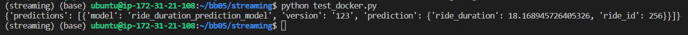

## Step 7 ##
Now that we have the docker container ready and tested, we can push the image to AWS docker repository in ECR.

[1]  
Prerequisite: configure aws cli with ```aws configure``` and access keys downloaded earlier.

[2]  
Create a new AWS repo and take note of repositoryuri.

``` bash
aws ecr create-repository --repository-name duration-model
```

[3]  
Login to ECR

``` bash
$(aws ecr get-login --no-include-email)
```

[4]  

Push the docker image to ECR.

``` bash
REMOTE_URI="XXXXXXXXXXXXXXX.ecr.us-east-1.amazonaws.com/duration-model"
REMOTE_TAG="v1"
REMOTE_IMAGE=${REMOTE_URI}:${REMOTE_TAG}

LOCAL_IMAGE="stream-model-duration1:v1"
docker tag ${LOCAL_IMAGE} ${REMOTE_IMAGE}
docker push ${REMOTE_IMAGE}
```

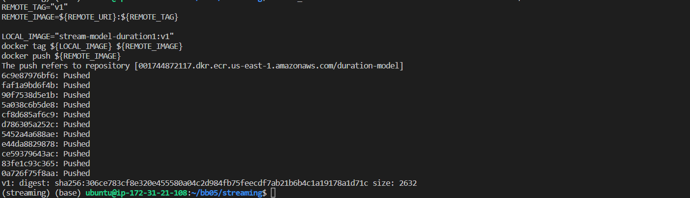

Verify the created image and copy the link.
``` bash
echo $REMOTE_IMAGE
```

## Step 8 ##

[1]  
Now we can create a new lambda function from the container image and select the existig role that we used before.

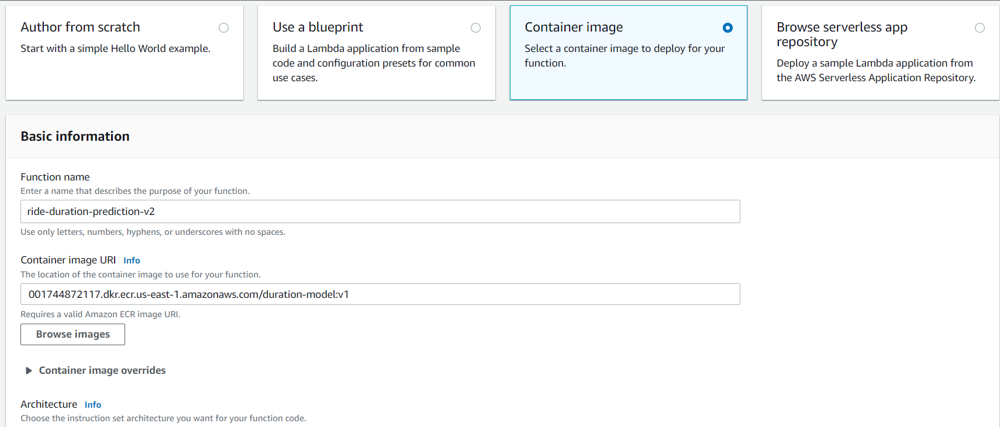

[2]  
Add environment variables as we did earlier in Lambda > Configuration > Environment variables.

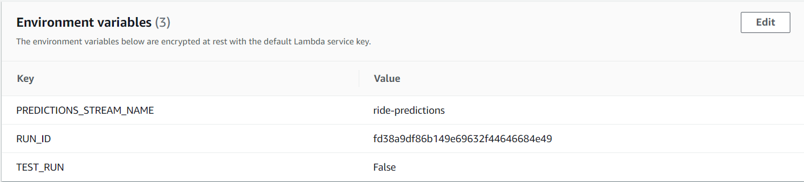

[3]  
Add kinesis stream that was created at the begining as trigger in lambda function.

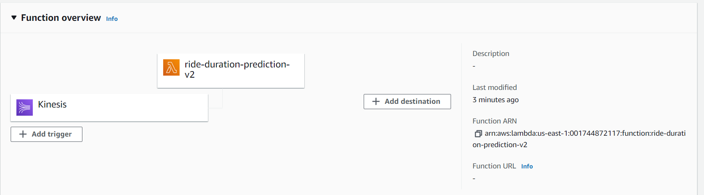

[4]  
Since this kinesis stream is sending data to other previsouly created lambda functions as well, we can disable trigger on those or optionally delete those functions.

I preferred to distable trigger on those in Lambda > Configuration.

[5]  
Since IAM role on Lambda needs access to S3 to fetch model, we need to provide s3 access to role.

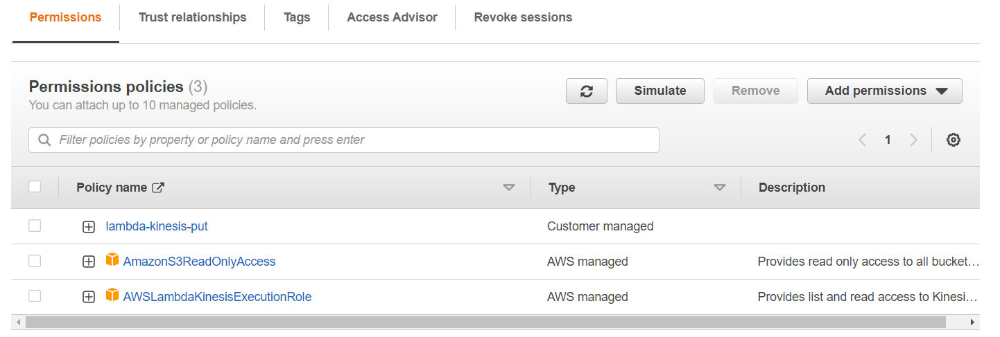

[5]  
Now put a record to the trigger kinesis stream.

``` bash
KINESIS_STREAM_INPUT=kinesis-ride-events
aws kinesis put-record \
    --stream-name ${KINESIS_STREAM_INPUT} \
    --partition-key 1 \
    --data '{
        "ride": {
            "PULocationID": 130,
            "DOLocationID": 205,
            "trip_distance": 3.66
        }, 
        "ride_id": 156
    }'
```

That should result in the shardid and sequence number as follows.

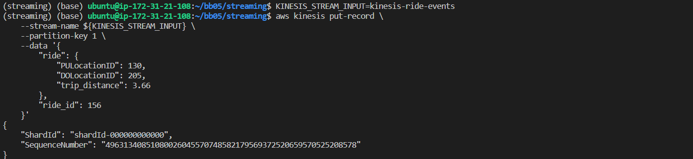

[6]  
In the cloudwatch logs of the lambda function if there are any errors according we can look into that. In my case there were memory and timeout related errors. Hence I changed the limit in Lambda > Configuration > General configuration as follows.

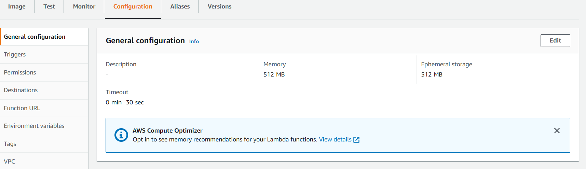

[7]  
We can test the changes locally as well like we did earlier. For that create a test configuration and test the lambda function.

Pass the following as input in the event.

``` JSON
{
  "Records": [
    {
      "kinesis": {
        "kinesisSchemaVersion": "1.0",
        "partitionKey": "1",
        "sequenceNumber": "49630081666084879290581185630324770398608704880802529282",
        "data": "ewogICAgICAgICJyaWRlIjogewogICAgICAgICAgICAiUFVMb2NhdGlvbklEIjogMTMwLAogICAgICAgICAgICAiRE9Mb2NhdGlvbklEIjogMjA1LAogICAgICAgICAgICAidHJpcF9kaXN0YW5jZSI6IDMuNjYKICAgICAgICB9LCAKICAgICAgICAicmlkZV9pZCI6IDI1NgogICAgfQ==",
        "approximateArrivalTimestamp": 1654161514.132
      },
      "eventSource": "aws:kinesis",
      "eventVersion": "1.0",
      "eventID": "shardId-000000000000:49630081666084879290581185630324770398608704880802529282",
      "eventName": "aws:kinesis:record",
      "invokeIdentityArn": "arn:aws:iam::387546586013:role/lambda-kinesis-role",
      "awsRegion": "eu-west-1",
      "eventSourceARN": "arn:aws:kinesis:eu-west-1:387546586013:stream/kinesis-ride-events"
    }
  ]
}
```

The test was successful!!

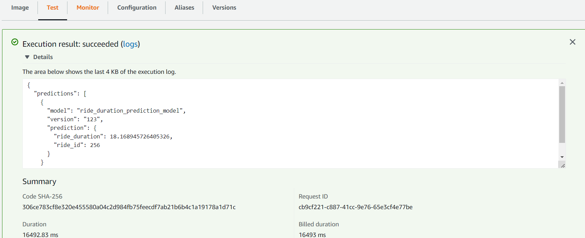

[8]  
Now again put the record to kinesis stream and check the result in cloudwatch logs. Modify the input data so as to confirm while verifying the output message stored in kinesis.

``` bash
KINESIS_STREAM_INPUT=kinesis-ride-events

aws kinesis put-record \
    --stream-name ${KINESIS_STREAM_INPUT} \
    --partition-key 1 \
    --data '{
        "ride": {
            "PULocationID": 130,
            "DOLocationID": 205,
            "trip_distance": 3.66
        }, 
        "ride_id": 356
    }'
```

[9]  
Run the following to read the data from kinesis stream.

``` bash
KINESIS_STREAM_OUTPUT='ride-predictions'
SHARD='shardId-000000000000'

SHARD_ITERATOR=$(aws kinesis \
    get-shard-iterator \
        --shard-id ${SHARD} \
        --shard-iterator-type TRIM_HORIZON \
        --stream-name ${KINESIS_STREAM_OUTPUT} \
        --query 'ShardIterator' \
)

RESULT=$(aws kinesis get-records --shard-iterator $SHARD_ITERATOR)

echo $RESULT | jq
```
Copy encoded data from data and run the following.

``` bash
echo "copied_encoded_data" | base64 -d | jq
```

That should give you the predicted result.

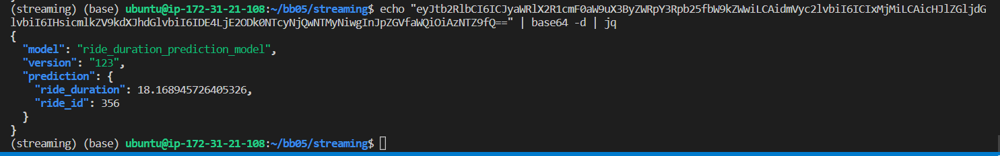

See, the ride_id is matching as in the input message sent to kinesis stream.


Hope you enjoyed the hands-on excersise. If you face any issues please reach out.

Happy learning!